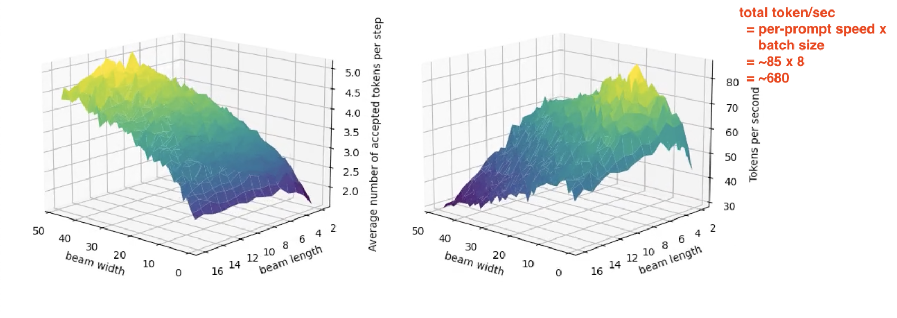

# Recurrent Drafter

This software project accompanies the research paper, [Recurrent Drafter for Fast Speculative Decoding in Large Language Models
](https://arxiv.org/abs/2403.09919).

The following animation compares recurrent drafting (right) with auto-regressive decoding (left) using bf16 precision on H100 GPUs. The prompt instructs the model to generate a travel plan. As visible in the animation, recurrent drafting is significantly faster than auto-regression. For a performance comparison against Medusa and similar methods, please see our paper.


Both methods were run in sampling mode, resulting in non-identical outputs. If identical results are required, running both in greedy search mode would achieve this. For more details, refer to [this guide](docs/parity_check.md).

Regarding the specific prompt used, the token acceptance rate was 3.17. By employing a larger dataset of prompts, we expect to observe a more realistic and higher acceptance rate, along with increased GPU utilization and enhanced text generation speed. The following animation shows the top per-prompt token generation speed with Vicuna 1.3 7B model and a batch size of 8, averaging about 85 tokens per second. This equates to a total throughput of 85x8=680 tokens per second. The average number of accepted candidate tokens per prompt is close to 5.

[](recurrent_drafting/benchmark/perf_wrt_candidates/bs-8-np-32-beam-48-len-16.mov)

## Installation

Run the following commands:

```shell
pip install --no-binary=protobuf -e ".[dev,train]"
```

The optional dependeny `dev` includes development tools like pre-commit, and `train` includes what the PyTorch-based training program needs.

Run unit tests in parallel:

```shell
pytest -n 8 --disable-warnings -s
```

## Train the Recurrent Drafter

A computer equipped with one or more contemporary CUDA GPUs. This training script, `train.py`, may use one or more GPUs via [Distributed Data Parallel](https://pytorch.org/tutorials/intermediate/ddp_tutorial.html).

We use the [ShareGPT](https://huggingface.co/datasets/Aeala/ShareGPT_Vicuna_unfiltered) dataset to train the Vicuna 1.3 model's recurrent drafter, and we use the [Alpaca](https://huggingface.co/datasets/tatsu-lab/alpaca_eval) dataset to evaluate the training results.

The training job fixes the parameters of the base Vicuna model and estimates only parameters of the drafter.  It takes about 1.5 hours to complete the training using the ShareGPT dataset and 8 H100 GPUs.

```
./recurrent_drafting/cmd/train.sh
```

## Run the Recurrent Drafter

The script `cmd/generate.py` supports both interactive mode and batch inference. Without the command-line option `--eval_mt_bench`, `generate.py` runs in interactive mode and waits for the user to type in the prompt via stdin. With the command-line option `--eval_mt_bench`, `generate.py` reads the input prompts from Hugging Face. To use the first, say 64, evaluation data instances, use: `--max_num_prompts=64`.

```
python3 -m recurrent_drafting.cmd.generate \
    --hf_tokenizer=lmsys/vicuna-7b-v1.3 \
    --hf_llm=lmsys/vicuna-7b-v1.3 \
    --hf_drafter=$HOME/m/redrafter \
    --eval_mt_bench=True \
    --max_prompt_length=500 \
    --max_generation_length=2048 \
    --beam_width=45 \
    --beam_length=5 \
    --greedy_search=False \
    --batch_size=8 \
    --dtype=bf16
```

To specify a certain GPU, say, the fourth one, use: `--use_gpu=3`. To run generate.py on CPU, use a negative GPU index: `--use_gpu=-1`

## Documentation

Please refer to [the documentation site](docs/index.md).

## Citation

If this project is useful for your work, please cite our paper:

```
@article{zhang2024recurrent,
  title={Recurrent Drafter for Fast Speculative Decoding in Large Language Models},
  author={Aonan Zhang and Chong Wang and Yi Wang and Xuanyu Zhang and Yunfei Cheng},
  journal={arXiv:2403.09919},
  year={2024},
  url={https://arxiv.org/abs/2403.09919},
  doi={10.48550/arXiv.2403.09919}
}
```
