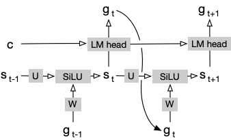

# The Recurrent Drafter for Fast Decoding with Large Language Models

Given a tokenized prompt string, ${w_0, w_1, \\ldots, w_p}$, we call the LLM to compute

1. the key and value of each token on each layer $l$, denoted by $k^l(w_i) \\text{ and } v^l(w_i) \\text{ for } 1\\leq l\\leq L$, and
1. the hidden state of the last token from the last layer $L$, denotedy by $h^L(w_p)$.

Then, we can call the vanilla LM head to convert $h^L(w_p)$ into a token distribution $P(g_0|h^L(w_p))$, from which, we could sample the first generated token $g_0 \\sim P(g_0|h^L(w_p))$.

The recurrent drafter takes $g_0$ and $h^L(w_p)$ to initialize the beam search algorithm that produces $M$ beams of draft token sequences, each with length $C$ (In our code, we prepend $g_0$ to all beams for easier processing, resulting actual length of $C+1$ for each beam):

1. $\\mathbf{b}\_{m,t=0}={ g_0 }$ is the $m$-th beam, which will grow with each beam search step,
1. $\\log P(\\mathbf{b}\_{m,t=0}) = \\log 1$ because $g_0$ has been there,
1. $c_m = h^L(w_p)$ is a constant and is used by all steps,
1. $s\_{m,t=0} = 0$ is the state at each step $t$.

In each of the following beam search step $t$, where $1\\leq t\\leq C$, the algorithm updates the above variables:

1. $s\_{m,t} = \\texttt{SiLU}( W\\cdot E(g\_{t-1}) + U \\cdot s\_{m,t-1} )$
1. $\\log P(g\_{m,t}) = \\texttt{LMHead}( c_m \\oplus s\_{m,t} )$
1. $\\log P(g\_{m,t} , \\mathbf{b}\_{m,t-1}) = \\log P(g\_{m,t}) + \\log P(\\mathbf{b}\_{m,t-1})$

The above equations reveal the structure of the drafter model as in the following figure:

Both $\\log P(g\_{m,t})$ and $\\log P(g\_{m,t},\\mathbf{b}\_{m,t-1})$ are in shape $(M,V)$. The beam search algorithm then gets the top $M$ candidates from these $M\\times V$ options, where each option represents a new token $g_t$ extended from an existing beam. Given these options, the algorithm updates the following variables and then moves to the next step until each beam has up to $C$ draft tokens.

1. $\\mathbf{b}\_{m,t}$
1. $s\_{m,t}$
1. $\\log P(\\mathbf{b}\_{m,t})$
