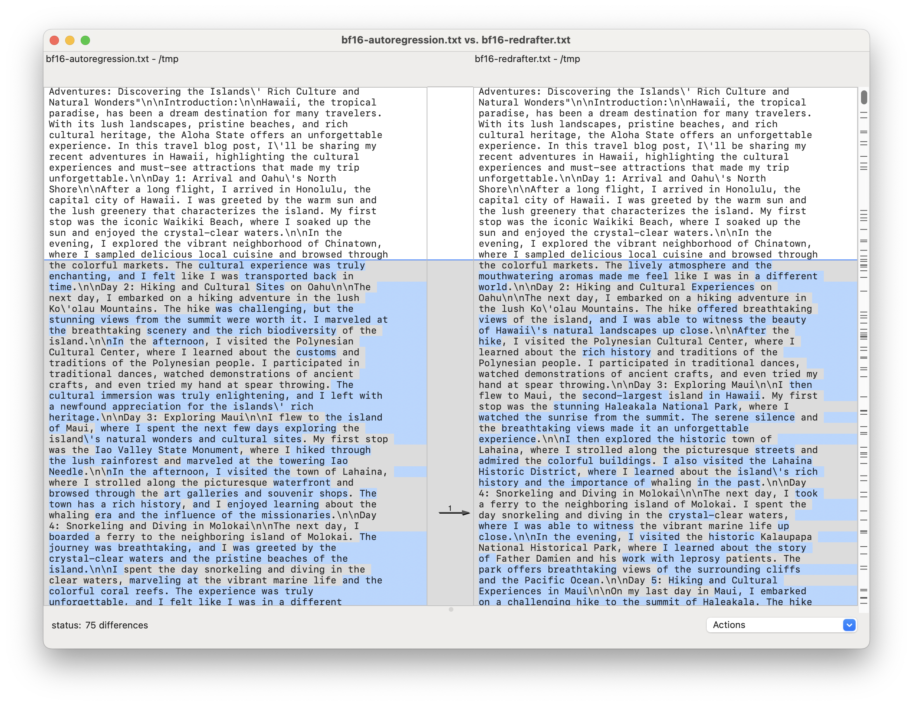
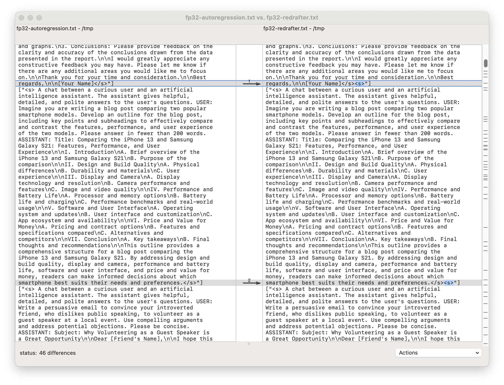

# Parity Check: Recurrent Drafting versus Auto-Regressive Decoding

## TL;DR

In greedy search mode, both recurrent drafting and auto-regressive decoding theoretically output the same text when given the same prompt. This is typically true with fp32 precision. However, with bf16 precision, the reduced numerical accuracy can lead to different results.

## Sampling and Search

Both the well-known auto-regressive decoding and the recurrent drafting approach support two modes:

1. Sampling
1. Greedy search

In sampling mode, auto-regressive generation samples a token from the vocabulary logits. Similarly, recurrent drafting uses the speculative sampling algorithm, as explained in [`speculative_sampling.md`](./speculative_sampling.md). Due to the non-deterministic nature of sampling, verifying identical outputs from the two algorithms is infeasible.

In greedy search mode, it is guaranteed that both algorithms will produce the same output for a given prompt. This mode selects the most likely token by applying `argmax` to the vocabulary logits. In auto-regressive decoding, logits come from the vanilla language model (LM) head, while in recurrent drafting, they also come from the drafter model. The verification and acceptance process in recurrent drafting, as implemented in `_greedy_choose_from_candidates`, ensures that the selected tokens match those from the auto-regressive algorithm.

## Parity Check

The following bash script was executed on a host with H100 GPUs to compare the two algorithms in greedy search mode:

```shell
#!/usr/bin/env bash

basic_cmd='
python3 -m recurrent_drafting.cmd.generate
    --hf_tokenizer=lmsys/vicuna-7b-v1.3
    --hf_llm=lmsys/vicuna-7b-v1.3
    --hf_drafter=$HOME/m/redrafter
    --eval_mt_bench=True
    --max_prompt_length=500
    --max_generation_length=2048
    --max_num_prompts=-1
    --batch_size=1
    --greedy_search=True
'

recurrent_drafting_specific='
  --autoregression=False
    --beam_width=45
    --beam_length=5
'

autoregressive_decoding_specific='
  --autoregression=True
'

recurrent_draft() {
  dtype=$1
  gpu=$2
  cmd="${basic_cmd}
  ${recurrent_drafting_specific}
    --dtype=$dtype
    --use_gpu=$gpu > /tmp/$dtype-redrafter"
  eval $cmd
}

autoregressive_decode() {
  dtype=$1
  gpu=$2
  cmd="${basic_cmd}
  ${autoregressive_decoding_specific}
    --dtype=$dtype
    --use_gpu=$gpu > /tmp/$dtype-autoregression"
  eval $cmd
}

recurrent_draft bf16 0 &
autoregressive_decode bf16 1 &

recurrent_draft fp32 2 &
autoregressive_decode fp32 3 &
```

This script runs four experiments using prompts from the [mt_bench](https://huggingface.co/spaces/lmsys/mt-bench) dataset to compare the algorithms in bf16 and fp32 precisions.

Theoretically, since all four experiments run in greedy search mode, the comparisons should be identical. However, tests show that in bf16 precision, the two algorithms output up to 14,523 different words, whereas in fp32, the discrepancy is significantly reduced to just 736 words.

```
$ diff <(fold -s -w 60 /tmp/bf16-autoregression) <(fold -s -w 60 /tmp/bf16-redrafter) | wc -w
   14523
$ diff <(fold -s -w 60 /tmp/fp32-autoregression) <(fold -s -w 60 /tmp/fp32-redrafter) | wc -w
     736
```

Opendiff can visualize the word differences. In bf16 precision, many discrepancies appear, likely due to the insufficient precision for `argmax` to accurately distinguish between highly similar words.



Further analysis confirmed that in fp32 precision, which provides higher accuracy, the number of discrepancies significantly decreases.



Reviewing the word differences in Opendiff one-by-one revealed that:

1. Autoregressive Decoding Algorithm: The algorithm terminates after outputting the ending token `</s>`, adhering strictly to its defined stopping condition.

1. Recurrent Drafting Model: The drafter model occasionally generates a sequence `</s><s>` as candidate tokens. This sequence is accepted by the base LLM because `</s></s>` is a prevalent pattern in the ShareGPT training data, used to separate turns in conversations. This behavior aligns well with the model's training and can be easily adjusted with trivial post-processing to remove the extra `<s>` if desired.
