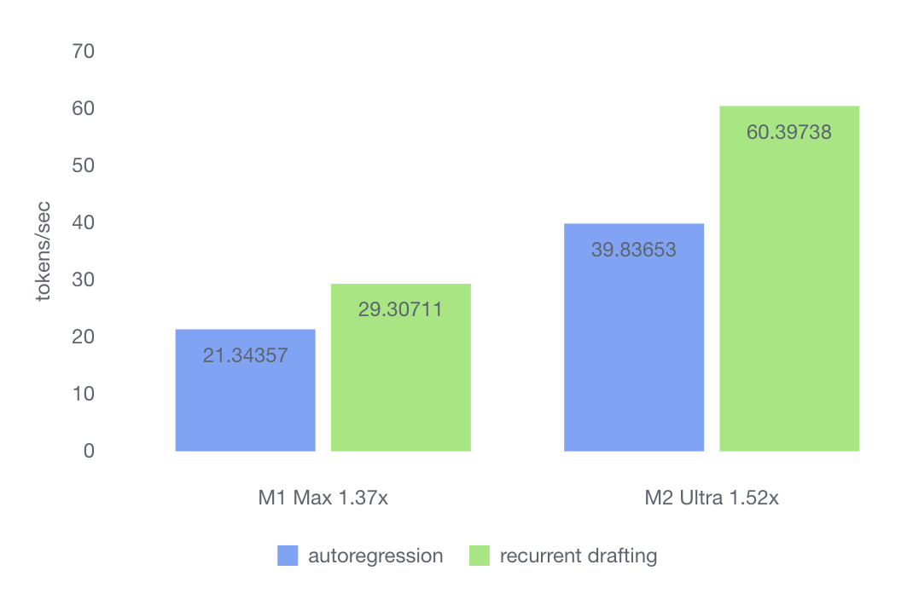
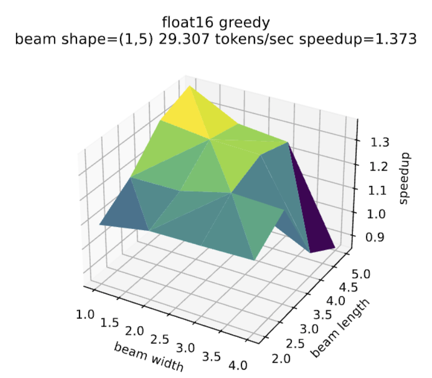
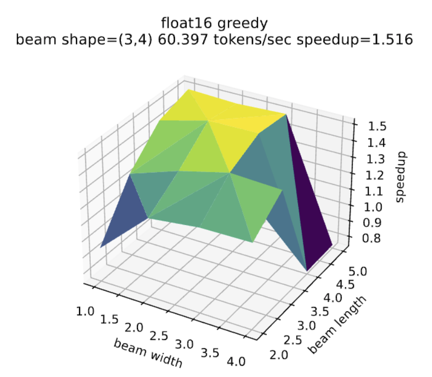

# Benchmark Recurrent Drafting, A Fast Speculative Decoding Method, in MLX

Yunfei Cheng, Yi Wang, Awni Hannan, Chong Wang, Aonan Zhang, Xuanyu Zhang

## Speculative Decoding is Helpful on Apple Silicon

Earlier this year, we published our work on Recurrent Drafting (https://arxiv.org/abs/2403.09919). Our PyTorch implementation (https://github.com/apple/ml-recurrent-drafter/) demonstrated a 4x speedup over autoregressive methods on CUDA GPUs. This remarkable improvement stems from the fact that speculative decoding better leverages the highly parallelized architecture of GPUs. By reducing the number of calls to large language models (LLMs) and generating multiple tokens per call, we can maximize GPU efficiency. On powerful GPUs, generating multiple tokens in a single call incurs only a marginal increase in time compared to generating one token. However, this raises the question: would speculative decoding still be advantageous on the Apple GPUs found in Apple silicon chips, which may not be as computationally powerful?

This article brings good news: on the M1 Max and M2 Ultra, Recurrent Drafting in MLX achieves speedups of 1.37x and 1.52x, respectively, compared to autoregressive methods. The comparison was conducted in float16, and we are continuing our efforts to accelerate LLM inference using 4-bit quantization. While these speedups may not match the 4x improvement seen on CUDA GPUs, Apple silicon chips consume only a fraction of the power compared to CUDA GPUs, and they run efficiently on devices like Macs and iPads.

## Optimal Speedup and GPU Potential

To gain detailed insights into the behavior of Recurrent Drafting on Apple silicon chips, we need to analyze the speedup in relation to two key inference-time parameters: beam search width and sequence length.

In each decoding step, Recurrent Drafting alternates between calling the draft model to generate draft tokens and calling the LLM to verify and accept them. The draft model, based on a recurrent neural network (RNN), is invoked by the beam search algorithm to generate *M* draft token sequences. After removing duplicate prefixes from these sequences, Recurrent Drafting calls the LLM to verify the remaining ones. The verification result is then used to accept one of the sequences, specifically the prefix of it that the autoregressive algorithm would generate.

The parameter *beam width* refers to the number *M* of draft token sequences. A larger beam width increases the likelihood that the sequence with the longest acceptable prefix is included in the beam. This allows the LLM to accept more tokens in each decoding step, reducing the overall number of decoding steps required—or, equivalently, decreasing the number of calls to the LLM.

However, a wider beam requires more FLOPs for the LLM to verify the draft tokens. While a powerful GPU can process these FLOPs in parallel, minimizing the increase in wall time, it also implies higher power consumption and computational cost.

The parameter *beam length* refers to the number of steps in the beam search algorithm, the number of calls to the RNN draft model, or equivalently, the length of the draft token sequences in the beam. A longer beam increases the length of the prefix that can be accepted, reducing the number of decoding steps or calls to the LLM. However, this length is constrained by the token sequence length used during the training of the RNN draft model.

The following two figures illustrate the speedup in relation to beam width and beam length on the M1 Max and M2 Ultra.

<table>
<tr><td></td><td></td></tr>
<tr><td align="center" valign="middle">(a) M1 Max</td><td align="center" valign="middle">(b) M2 Ultra</td></tr>
</table>

From these figures, we can observe that optimal speedup (colored in yellow) is achieved when the beam length is close to the length of the training sequences used for the RNN draft model. This maximizes the predictive power of the RNN. However, the optimal speedup is not necessarily achieved at the exact training length of 5; it can occur at a slightly shorter length, such as 4, since the RNN may not always accurately predict the 5th token.

We also observe that the optimal speedup is achieved with narrower beams—1 for the M1 Max and 3 for the M2 Ultra. In contrast, our experiments on A100 and H100 GPUs using PyTorch show that the optimal speedup is achieved with beam widths of 50 or more. This discrepancy is due to the inherent performance gap between server-grade GPUs and mobile GPUs, which is expected. It also explains why the M2 Ultra can handle a wider optimal beam of 3, compared to the M1 Max’s 1, as the M2 Ultra is equipped with a more powerful GPU.

## Performance Tuning: MLX and Apple Silicon

Before starting the MLX implementation, we had experience with PyTorch and TensorRT-LLM. However, working on our first MLX project revealed that many lessons we learned from programming CUDA no longer apply to MLX and Apple silicon. Below, we share some of the key lessons learned from this journey.

### Use Native Dtype and Low-Bits

Our benchmark code explores various factors, including data types (dtype). As shown in the raw result data located in the directory `recurrent_drafting/mlx/experiments`, running autoregression and recurrent drafting in float16 is consistently faster than in bfloat16. We also observed that both float16 and bfloat16 outperform float32, as they use less memory access bandwidth. Similarly, as reported by other studies, 4-bit quantization significantly accelerates MLX programs compared to float16.

### MLX Does Lazy Evaluation

While PyTorch programs execute eagerly, MLX programs run lazily. In MLX, the Python code may appear to be executing tensor operations sequentially, but these operations might not actually run until the final result is printed. This lazy execution extends beyond numerical operations; even loading model parameters from the filesystem into tensors in memory is done lazily. To ensure that a model is fully loaded before benchmarking the inference algorithm, you must call `mx.eval(model.parameters())` before invoking the model.

### Don’t Break the JIT Compilation

Lazy evaluation in MLX allows it to silently trace tensor operation calls and compile these traces just-in-time into Apple GPU kernels for improved runtime performance. While this provides convenience, it can also influence how we program. For example, during a comparison of the execution time between MLX functions and their PyTorch counterparts, we noticed that one MLX function consumed a disproportionately large fraction of the total running time, whereas its PyTorch equivalent did not. After consulting Awni Hannun, the tech lead of MLX, we discovered that the presence of the `array.item()` calls causes MLX to break the program down into small subgraphs and execute each one. It takes longer to execute these small graphs than a single large one since each run necessitates synchronization.

### Measure Performance in All Levels of Details

The Instruments app, included with Xcode, provides visualization of CPU threads and Apple GPU operations, similar to NVIDIA’s NSight. This tool helps developers gain a general understanding of potential bottlenecks in their code. To measure the execution time of each function, we developed the utility `recurrent_drafting/mlx/time_mlx.py`. This utility offers a Python decorator that, when applied to a function, measures and records the function’s execution time into a data structure known as the ledger. At the end of the program, the ledger can be printed to visualize both the absolute and relative time consumed by each function.
